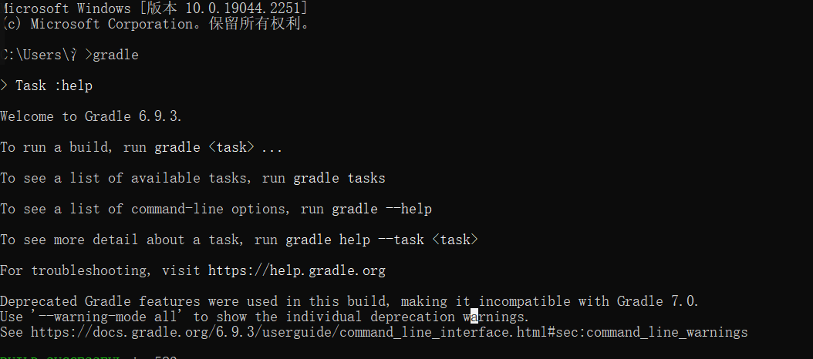
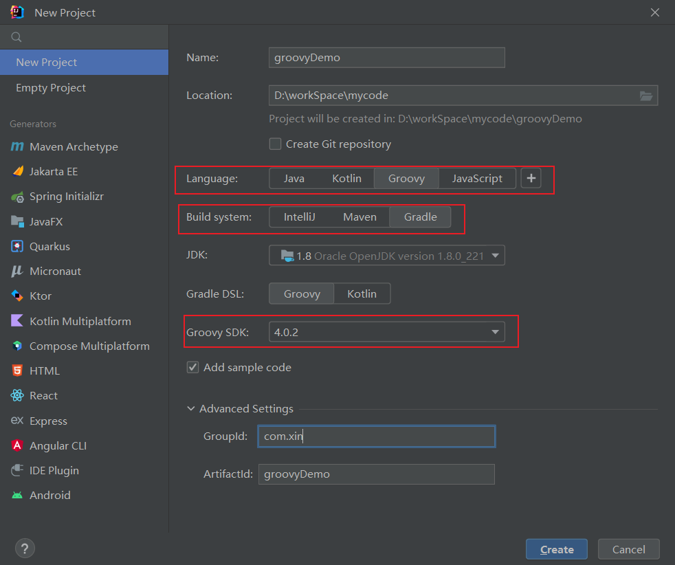
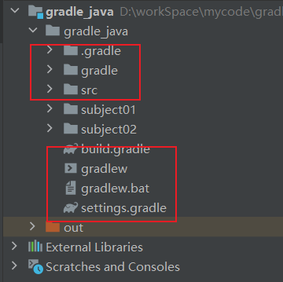
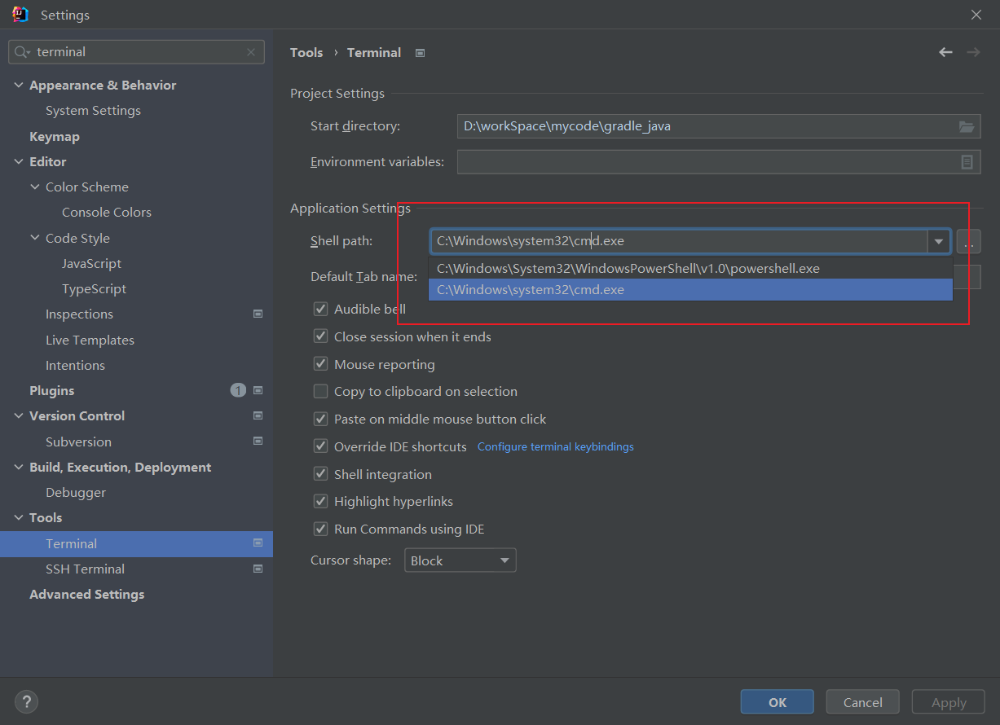
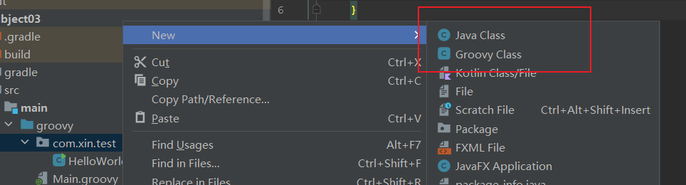
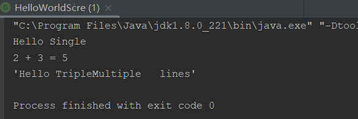
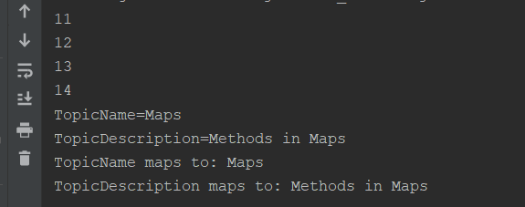

[toc]

# 1. 入门

## 1.1 简介

Gradle 是一款 Google 推出的基于 JVM、通用灵活的项目构建工具，支持 Maven，JCenter 多种第三方仓库;支持传递性依赖管理、废弃了繁杂的 xml 文件，转而使用简洁的、支持多种语言(例如：java、groovy 等)的 build 脚本文件。官方网站: https://gradle.org/

> 只spring boot 2.3之后，spring boot 官方开始以使用gradle来作为项目构建使用。
>
> 可查看spring boot 2.3 git 地址 ：[spring boot 2.3 ](https://github.com/spring-projects/spring-boot/tree/2.3.x)

## 1.2 构建工具

主要的构建工具有三类: Ant , Maven , Gradle

>  ant在当前已经不再是主流的构建工具了，使用量也比较少。
>
> maven是当前主流的构建工具，侧重于项目包的管理。
>
> gradle在目前使用不如maven，但是有越来越多的项目开始以gradle的方式进行构建，在未来会得到更多的应用，gradle侧重于大型项目的构建。

## 1.3 gradle安装

:heavy_exclamation_mark: 需要注意的是，这一步是非必须的，gradle建议使用gradle包装器gradlew，gradlew可以解决不同项目中不同的版本gradle问题，使开发人员使用的是同一个版本的gradle。

[安装参考](https://gradle.org/install/)

### 1.3.1 jdk

版本在1.8及以上即可。[down load jdk1.8](https://www.oracle.com/java/technologies/downloads/#java8)

### 1.3.2 gradle

[下载gradle]([https://gradle.org/releases/](https://link.zhihu.com/?target=https%3A//gradle.org/releases/))

### 1.3.3 配置gradle的环境变量

> 新增GRADLE_HOME变量,值为gradle的安装路径
>
> 在path新增变量%GRADLE_HOME%\bin
>
> cmd测试： gradle，打印出gradle的基本信息。
>
> :star: ：对于变量GRADLE_USER_HOME(用来配置 Gradle 本地仓库位置和 Gradle Wrapper 缓存目录)，默认会找到目录<font color=Red>C:\Users\.m2\repository</font>,可以配置成自己想要保存的地址，推荐直接使用默认目录。

gradle安装测试示例：



### 1.3.4 修改maven镜像

gradle安装完成后会有一个init.d的文件夹，该文件夹存放一些.gradle的脚本文件，这些脚本文件在gradle build 之前就会被执行，因此只需要在init.d文件夹下创建脚本指令即可。脚本指令如下:

```groovy
allprojects {
    repositories {
        mavenLocal() 
        maven { name "Alibaba"; url "https://maven.aliyun.com/repository/public" }
        maven {name "Bstek"; url "https://nexus.bsdn.org/content/groups/public/"} 
        mavenCentral()
    }
    buildscript {
        repositories {
            maven { name "Alibaba"; url 'https://maven.aliyun.com/repository/public' }
            maven {name "Bstek"; url 'https://nexus.bsdn.org/content/groups/public/'}
            maven {name "M2"; url 'https://plugins.gradle.org/m2/'}
        }
    }
}
```

:star: 如果是使用的gradlew包装器，那么在对应的build.gradle中设置即可。

## 1.4 创建gradle项目

使用idea创建第一个gradle项目，语言在此处选择groovy。



创建完成后的项目目录结构如下:



各项文件说明:

```txt
./gradle   		: 存放gradle的执行信息
gradle     		: 存放gradlew内容,内置了wrapper jar和配置文件
src				: 存放项目代码和配置文件
build.gradle 	: 当前module的gradle配置文件,类似于maven的pom.xml
gradlew 		: gradle包装脚本
gradle.bat 		: gradle命令
settings.gradle	: 针对module的全局配置，属于项目唯一，作用域包含所有module
```

## 1.5 gradle基本指令

在此处介绍gradle的基本指令，更多内容会在后文中详细讲到。

[tip]: 在idea的terminal中执行gradlew指令，由于idea默认会使用powershell方式去执行命令行文件，在执行时类似于shell，因此可能会出现commondnotfound的问题。需要在配置中手动设置成为cmd方式执行



一些基本的指令内容如下，也可以在idea gradle窗口查看。

| 指令                 | 解释                                                         |
| -------------------- | ------------------------------------------------------------ |
| gradle clean         | 清空build目录，类似于maven clean，但是maven clean清空的是target |
| gradle classes       | 编译代码以及配置文件                                         |
| gradle test          | 编译测试代码并生成测试报告                                   |
| gradle build         | 构建项目，生成结果到build目录                                |
| gradle build -x test | 构建项目并跳过测试任务                                       |

# 2. groovy

Groovy是一种基于Java平台的面向对象语言，可以视为Java语言的脚本改良版。gradle是所采用的就是groovy脚本语言，因此需要了解一些groovy脚本的基本知识。

:red_circle: 和gradle一样，groovy也可以不用安装本地环境就可以运行。

[tip]: 对于groovy，它是gradle依赖的脚本文件，在本篇只介绍groovy的基本内容，不会更多深入介绍。

## 2.1 hello world

由于groovy是基于Java平台创建的。因此在很多特性上groovy和java类似，在创建时也是创建类，只是创建的是groovy的专有类groovy class。



第一个hello world程序:

```groovy
package com.xin.test

class HelloWorld {
    static void main(String[] args) {
        println "Hello world!"
    }
}
```

groovy除了可以使用类方式执行，最大的特点是作为脚本文件去执行相关操作。你需要创建一个groovy脚本文件，然后执行它即可。

```groovy
println("hello world")
```

## 2.2 基本语法

### 2.2.1 数据类型和权限修饰符

groovy的数据类型与Java数据类型差不太多，包括以下几种：

> byte , shot , int , long , float , double , char , boolean , string

同时也会有对应的包装类。

对于权限修饰符，groovy没有default，默认的就是public

### 2.2.2 类导入

groovy 也可以进行导入，使用import语句导入其他库的相关API，groovy默认导入了一些库，用户不需要显示的导入它们。

默认导入的库如下：

- import java.lang.*
- import java.util.*
- import java.io.* 
- import java.net.* 
- import groovy.lang.* 
- import groovy.util.* 
- import java.math.BigInteger 
- import java.math.BigDecimal

### 2.2.3 String字符串引号

groovy的字符串引号可以添加单引号，双引号和三引号。他们表达的内容也不相同。单引号表示作为一个字符串，双引号可以提供一定的运算能力，三引号相当于模板字符串，可以进行换行操作。

````groovy
// groovy的字符串区别
def n1 = 2
def n2 = 3
var a = 'Hello Single'
var b = "$n1 + $n2 = ${n1 + n2}"
var c = "'Hello Triple" + "Multiple " +
        "\tlines'"

println(a);
println(b);
println(c);
````

执行结果如下:



### 2.2.4 闭包

Groovy 中的闭包是一个开放的、匿名的代码块，它可以接受参数、也可以有返回值。闭包可以引用其周围作用域中声明的变量。有些类似于Java语言的lambda表达式。闭包的语法如下:

> { [closureParameters -> ] statements }
>
> 其中[ closureParameters-> ]是一个可选的逗号分隔的参数列表,参数后面是 Groovy 语句。参数类似于方法参数列表，
>
> 这些参数可以是类型化的,也可以是非类型化的。当指定参数列表时，需要使用-> 字符，用于将参数与闭包体分离。

下面是一个简单的闭包：

```groovy
def clos = {println "Hello World"}
clos.call()
```

在此处{println "Hello World"} 就被称为闭包，闭包的代码块可以调用call来执行，运行代码将会得到 hello world的输出内容。

在闭包中使用参数和变量:

```groovy
def str1 = "Hello";
def clos = {param -> println "${str1} ${param}"}
clos.call("World");
```

在该示例中，传递了param参数给闭包，同时定义了一个str1的变量，相应的，执行这段代码也会输出hello world。

对集合使用闭包：

针对list和map两种结构，处理闭包的方式和Java类似。具体示例如下：

```groovy
// 处理list闭包
def lst = [11, 12, 13, 14]
lst.each {println it}
// 处理map闭包
def mp = ["TopicName" : "Maps", "TopicDescription" : "Methods in Maps"]             
mp.each {println it}
mp.each {println "${it.key} maps to: ${it.value}"}
```

执行示例代码，将会输出以下内容：



### 2.2.5 基本语法，异常等其他内容

对于基本语法和异常等其他的内容，由于基本特性可以参考Java，因此不在过多赘述，详细内容可以参考groovy的官方文档。

[官方文档说明](http://www.groovy-lang.org/closures.html)

# 3. gradle 

## 3.1 gradle 任务

## 3.3 gradle 文件

## 3.4 gradle 依赖

## 3.5 gralde plugin

## 3.6 gradle publish 

